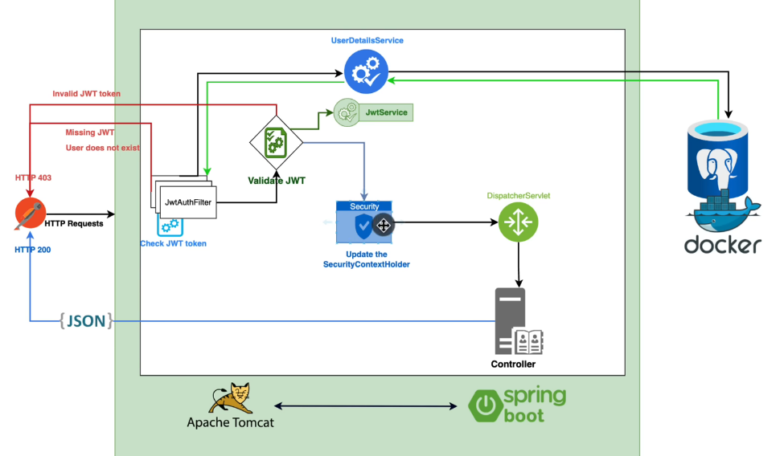

## Full Working of JWT



## Endpoints

```postman
1. Register the new User
Post: http://localhost:8080/api/v1/auth/register
  ```register Json
  {
    "firstname":"Vikash",
    "lastname":"Katiyar",
    "email":"vikash@gmail.com",
    "password":"1234"
 }
  ```  

2.Authenticate the existing or new User
Post: http://localhost:8080/api/v1/auth/authenticate
 ```authenticate json
  {
    "email":"vikash@gmail.com",
    "password": "1234"
  }
  
3. Check main endpoint
Get: http://localhost:8080/api/v1/auth/demo-controller  

```
